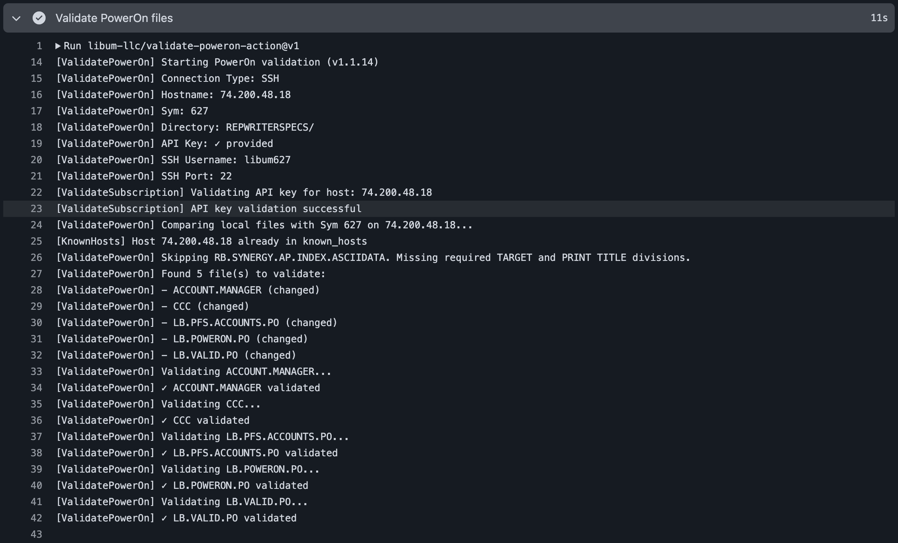

[](https://github.com/libum-llc/validate-poweron-action/releases/latest)
[](https://github.com/marketplace/actions/validate-poweron)
[](https://github.com/libum-llc/validate-poweron-action/actions?workflow=ci)

## About
GitHub Action to validate a PowerOn on the Jack Henry™ credit union core platform



___

- [Usage](#usage)
  - [Basic Example](#basic-example)
  - [Using HTTPS Connection](#using-https-connection)
  - [Validate All Files (No Target Branch)](#validate-all-files-no-target-branch)
  - [Ignoring Specific Files](#ignoring-specific-files)
- [Customizing](#customizing)
  - [Inputs](#inputs)
  - [Secrets](#secrets)
- [Contributing](#contributing)

## Usage

### Basic Example

```yaml
name: Validate PowerOn Files

on:
  pull_request:
    branches: [main]

jobs:
  validate:
    runs-on: self-hosted
    steps:
      - name: Checkout code
        uses: actions/checkout@v4
        with:
          fetch-depth: 0  # Required for git diff to work

      - name: Validate PowerOn files
        uses: libum-llc/validate-poweron-action@v1
        with:
          symitar-hostname: 93.455.43.232
          sym-number: 627
          symitar-user-number: 1995
          symitar-user-password: ${{ secrets.SYMITAR_USER_PASSWORD }}
          ssh-username: libum
          ssh-password: ${{ secrets.SSH_PASSWORD }}
          api-key: ${{ secrets.API_KEY }}
          target-branch: origin/${{ github.base_ref }}  # Uses PR's base branch
```

### Using HTTPS Connection

```yaml
- name: Validate PowerOn files (HTTPS)
  uses: libum-llc/validate-poweron-action@v1
  with:
    symitar-hostname: 93.455.43.232
    sym-number: 627
    symitar-user-number: 1995
    symitar-user-password: ${{ secrets.SYMITAR_USER_PASSWORD }}
    ssh-username: libum
    ssh-password: ${{ secrets.SSH_PASSWORD }}
    api-key: ${{ secrets.API_KEY }}
    symitar-app-port: '42627'
    connection-type: https
    target-branch: origin/main
```

### Validate All Files (No Target Branch)

```yaml
- name: Validate all PowerOn files
  uses: libum-llc/validate-poweron-action@v1
  with:
    symitar-hostname: 93.455.43.232
    sym-number: 627
    symitar-user-number: 1995
    symitar-user-password: ${{ secrets.SYMITAR_USER_PASSWORD }}
    ssh-username: libum
    ssh-password: ${{ secrets.SSH_PASSWORD }}
    api-key: ${{ secrets.API_KEY }}
    poweron-directory: REPWRITERSPECS/
```

### Ignoring Specific Files

```yaml
- name: Validate PowerOn files (with ignore list)
  uses: libum-llc/validate-poweron-action@v1
  with:
    symitar-hostname: 93.455.43.232
    sym-number: 627
    symitar-user-number: 1995
    symitar-user-password: ${{ secrets.SYMITAR_USER_PASSWORD }}
    ssh-username: libum
    ssh-password: ${{ secrets.SSH_PASSWORD }}
    api-key: ${{ secrets.API_KEY }}
    target-branch: origin/main
    validate-ignore: TEST.PO,DEPRECATED.PO,EXAMPLE.PO
```

## Customizing

### Inputs

| Input | Description | Required | Default |
|-------|-------------|----------|---------|
| `symitar-hostname` | The endpoint by which you connect to the Symitar host | Yes | - |
| `sym-number` | The directory (aka Sym) number for your connection | Yes | - |
| `symitar-user-number` | Your Symitar Quest user number (just the number) | Yes | - |
| `symitar-user-password` | Your Symitar Quest password (just the password) | Yes | - |
| `ssh-username` | The AIX user name for the Symitar host | Yes | - |
| `ssh-password` | The AIX password for the Symitar host | Yes | - |
| `ssh-port` | The port to connect to the SSH server | No | `22` |
| `api-key` | Your PowerOn Pipelines API Key from [Libum Portal](https://portal.libum.io) | Yes | - |
| `symitar-app-port` | The port which your SymAppServer communicates over. This is typically `42` + `symNumber` | No | - |
| `connection-type` | Connection type: "https" or "ssh" | No | `ssh` |
| `poweron-directory` | The directory in the repository to monitor PowerOn changes in | No | `REPWRITERSPECS/` |
| `target-branch` | Target branch to compare against for changed files (e.g., origin/main) | No | - |
| `validate-ignore` | Comma-separated list of PowerOn filenames to ignore during validation | No | `''` |
| `debug` | Enable debug logging for Symitar clients | No | `false` |

### Outputs

| Output | Description |
|--------|-------------|
| `files-validated` | Number of PowerOn files validated |
| `files-passed` | Number of PowerOn files that passed validation |
| `files-failed` | Number of PowerOn files that failed validation |

### Secrets

The following secrets should be configured in your repository:

- `SYMITAR_USER_PASSWORD` - Your Symitar Quest password (just the password)
- `SSH_PASSWORD` - The AIX password for the Symitar host
- `API_KEY` - Your PowerOn Pipelines API Key from [Libum Portal](https://portal.libum.io)

## Contributing
We at [Libum](https://libum.io) are committed to improving the software development process of Jack Henry" credit unions. The best way for you to contribute / get involved is communicate ways we can improve the Validate PowerOn Action feature set.

Please share your thoughts with us through our [Feedback Portal](https://feedback.libum.io), on our [Libum Community](https://discord.gg/libum) Discord, or at [development@libum.io](mailto:development@libum.io)
