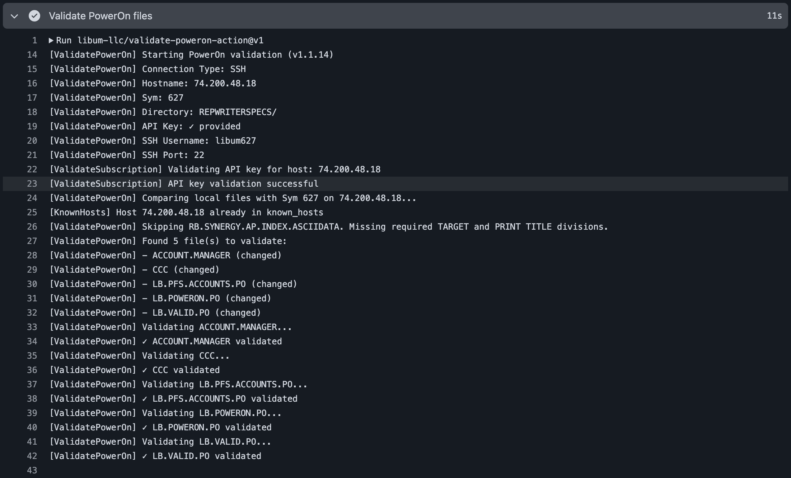

[](https://github.com/libum-llc/validate-poweron-action/releases/latest)
[](https://github.com/marketplace/actions/validate-poweron)
[](https://github.com/libum-llc/validate-poweron-action/actions?workflow=ci)

## About
GitHub Action to validate a PowerOn on the Jack Henry™ credit union core platform



Upgrading from v1? See [CHANGELOG.md](CHANGELOG.md).

___

- [Usage](#usage)
  - [Basic Example (HTTPS)](#basic-example-https)
  - [Using SSH Connection](#using-ssh-connection)
  - [Validate All Files (No Target Branch)](#validate-all-files-no-target-branch)
  - [Ignoring Specific Files](#ignoring-specific-files)
  - [Preserving Server-Managed Files](#preserving-server-managed-files)
  - [Debugging Comparisons](#debugging-comparisons)
- [List Inputs](#list-inputs)
- [Server-Managed File Warnings](#server-managed-file-warnings)
- [When Nothing Gets Validated](#when-nothing-gets-validated)
- [When the Checkout Is Too Shallow](#when-the-checkout-is-too-shallow)
- [Customizing](#customizing)
  - [Inputs](#inputs)
  - [Outputs](#outputs)
  - [Secrets](#secrets)
- [Contributing](#contributing)

## Usage

### Basic Example (HTTPS)

`connection-type: https` requires `symitar-app-port`. SSH credentials are still required — the HTTPS client uses them internally for change detection.

```yaml
name: Validate PowerOn Files

on:
  pull_request:
    branches: [main]

jobs:
  validate:
    runs-on: self-hosted
    steps:
      - name: Checkout code
        uses: actions/checkout@v4
        with:
          fetch-depth: 0  # Required for git diff to work

      - name: Validate PowerOn files
        uses: libum-llc/validate-poweron-action@v2
        with:
          symitar-hostname: 93.455.43.232
          sym-number: 627
          symitar-user-number: 1995
          symitar-user-password: ${{ secrets.SYMITAR_USER_PASSWORD }}
          ssh-username: libum
          ssh-password: ${{ secrets.SSH_PASSWORD }}
          api-key: ${{ secrets.API_KEY }}
          # Required for HTTPS: the default is ssh.
          connection-type: https
          symitar-app-port: '42627'
          # target-branch is omitted here on purpose: on pull_request events
          # it defaults to the PR's base branch (GITHUB_BASE_REF).
```

### Using SSH Connection

`ssh` is the default, so omitting `connection-type` skips HTTPS and `symitar-app-port` entirely.

```yaml
- name: Validate PowerOn files (SSH)
  uses: libum-llc/validate-poweron-action@v2
  with:
    symitar-hostname: 93.455.43.232
    sym-number: 627
    symitar-user-number: 1995
    symitar-user-password: ${{ secrets.SYMITAR_USER_PASSWORD }}
    ssh-username: libum
    ssh-password: ${{ secrets.SSH_PASSWORD }}
    api-key: ${{ secrets.API_KEY }}
    connection-type: ssh
    target-branch: main
```

### Validate All Files (No Target Branch)

Without a `target-branch` and outside a `pull_request` event, the action compares the local directory against what is deployed on the Symitar host instead of using `git diff`. Use `sync-method` to control the transfer transport used for that comparison.

```yaml
- name: Validate all PowerOn files
  uses: libum-llc/validate-poweron-action@v2
  with:
    symitar-hostname: 93.455.43.232
    sym-number: 627
    symitar-user-number: 1995
    symitar-user-password: ${{ secrets.SYMITAR_USER_PASSWORD }}
    ssh-username: libum
    ssh-password: ${{ secrets.SSH_PASSWORD }}
    api-key: ${{ secrets.API_KEY }}
    connection-type: https
    symitar-app-port: '42627'
    poweron-directory: REPWRITERSPECS/
    sync-method: sftp
```

### Ignoring Specific Files

```yaml
- name: Validate PowerOn files (with ignore list)
  uses: libum-llc/validate-poweron-action@v2
  with:
    symitar-hostname: 93.455.43.232
    sym-number: 627
    symitar-user-number: 1995
    symitar-user-password: ${{ secrets.SYMITAR_USER_PASSWORD }}
    ssh-username: libum
    ssh-password: ${{ secrets.SSH_PASSWORD }}
    api-key: ${{ secrets.API_KEY }}
    connection-type: https
    symitar-app-port: '42627'
    target-branch: main
    validate-ignore: TEST.PO, DEPRECATED.PO, EXAMPLE.PO
```

### Preserving Server-Managed Files

Use `preserve-server-files` for files that are generated or forcibly updated by the server. Matched files are skipped during validation so pull requests do not validate repository copies that should be preserved from the Symitar server. It also suppresses the [server-managed file warning](#server-managed-file-warnings) for any file it covers.

```yaml
- name: Validate PowerOn files (preserve server-managed files)
  uses: libum-llc/validate-poweron-action@v2
  with:
    symitar-hostname: 93.455.43.232
    sym-number: 627
    symitar-user-number: 1995
    symitar-user-password: ${{ secrets.SYMITAR_USER_PASSWORD }}
    ssh-username: libum
    ssh-password: ${{ secrets.SSH_PASSWORD }}
    api-key: ${{ secrets.API_KEY }}
    connection-type: https
    symitar-app-port: '42627'
    target-branch: main
    preserve-server-files: RD.*, PFR.*
```

### Debugging Comparisons

Set `debug: true` to see, per run, which comparison strategy was used and why each file was considered changed. This is most useful in [no-target-branch](#validate-all-files-no-target-branch) mode, where "changed" is determined by comparing the local directory against the deployed Symitar host rather than by `git diff`:

```yaml
- name: Validate PowerOn files (debug)
  uses: libum-llc/validate-poweron-action@v2
  with:
    # ...other inputs...
    debug: true
```

With `debug: true`, the action's debug log includes a line describing the comparison strategy (transport and compare mode), followed by one line per file explaining why it was considered changed, e.g.:

```
Change detection strategy: SFTP quick comparison (file presence and normalized byte size; timestamps and content hashes are not compared)
FILENAME.PO: considered changed because it is missing from Sym or its normalized byte size differs
```

GitHub Actions only surfaces `debug`-level log lines when step debug logging is enabled for the run (the `ACTIONS_STEP_DEBUG` secret/variable, or re-running with debug logging). Setting the `debug` input to `true` controls what this action *emits*; it does not by itself turn on GitHub's step debug logging.

## List Inputs

`validate-ignore` and `preserve-server-files` accept commas, newlines, or a YAML block sequence — all three forms work, and they can be mixed. Entries are matched against file basenames, and `preserve-server-files` also accepts glob patterns (`*`, `?`).

```yaml
# Comma-delimited (good for short lists)
validate-ignore: TEST.PO, DEPRECATED.PO

# Multi-line (one item per line)
validate-ignore: |
  TEST.PO
  DEPRECATED.PO

# YAML block sequence
validate-ignore: |
  - TEST.PO
  - DEPRECATED.PO
```

Leading `- ` markers are stripped and blank entries are dropped. `synchronize-symitar-action` parses its list inputs the same way.

## Server-Managed File Warnings

Symitar frequently regenerates or force-updates certain files as a side effect of server activity outside of your repository (e.g. reports, forms, letters generated by report/document writers). This action recognizes filenames matching `RB.*`, `RD.*`, or `PFR.*` as typically server-managed.

When a file matching one of those patterns is in scope for a run — via `git diff` on a `pull_request`, or via hash comparison in [no-target-branch mode](#validate-all-files-no-target-branch) — and is **not** covered by `preserve-server-files`, the action emits a GitHub Actions warning annotation naming the file(s) and recommending you add the matching pattern to `preserve-server-files`. This is a warning, not a failure: the run still validates and can still succeed.

To suppress the warning for files you have intentionally chosen to preserve from the server, add the matching pattern(s) to `preserve-server-files`:

```yaml
preserve-server-files: RD.*, PFR.*
```

If a matched file is *not* server-managed in your setup and should be validated normally, there is no way to suppress the warning without also excluding it from validation (via `preserve-server-files` or `validate-ignore`) — the warning exists specifically to flag files this action cannot otherwise distinguish from server-managed ones.

## When Nothing Gets Validated

Two situations end a run with `files-validated`, `files-passed` and `files-failed` all `0` and the step **green**. Neither is a failure, and both are easy to mistake for "everything passed".

**A tag or release run.** Which files the action looks at is decided by the two refs it can see: it uses `git diff` when a target branch resolves, and hash comparison against the Symitar host when only the build ref looks like a branch. On a tag or release build `GITHUB_REF` is `refs/tags/v1.0.0`, and with no `target-branch` input neither ref qualifies — so the action never contacts Symitar, validates nothing, and exits 0. It emits a **warning annotation** saying so. To validate on a tag build, set `target-branch` explicitly; otherwise run this action on `push` or `pull_request` events, where `GITHUB_REF` is a `refs/heads/` ref.

**A pull request that changed no PowerOns.** In `git diff` mode, a pull request touching nothing under `poweron-directory` legitimately has nothing to validate. This is the normal, correct result — worth knowing only so a green `0/0/0` is not read as proof that validation ran.

## When the Checkout Is Too Shallow

`actions/checkout` defaults to a depth-1 clone that fetches no other refs, so `origin/<base>` does not exist in the workspace. In `git diff` mode the action verifies that ref before diffing and fails with a message naming the fix:

```
Invalid input 'targetBranch': Target branch 'origin/main' not found. actions/checkout
defaults to a shallow clone that fetches no other refs, so set 'fetch-depth: 0' on the
checkout step (or confirm the branch exists).
```

Every example in this README sets `fetch-depth: 0` for this reason. It is only needed in `git diff` mode; hash-comparison runs never shell out to git.

## Customizing

### Inputs

| Input | Description | Required | Default |
|-------|-------------|----------|---------|
| `symitar-hostname` | The endpoint by which you connect to the Symitar host | Yes | - |
| `sym-number` | The directory (aka Sym) number for your connection. A whole number between 0 and 999; anything else is rejected as a typo. | Yes | - |
| `symitar-user-number` | Your Symitar Quest user number (just the number) | Yes | - |
| `symitar-user-password` | Your Symitar Quest password (just the password) | Yes | - |
| `ssh-username` | The AIX user name for the Symitar host. Required even when `connection-type` is `https` — the HTTPS client delegates change detection to an SSH client built from these credentials. | Yes | - |
| `ssh-password` | The AIX password for the Symitar host. Required even when `connection-type` is `https` — the HTTPS client delegates change detection to an SSH client built from these credentials. | Yes | - |
| `ssh-port` | The port to connect to the SSH server | No | `22` |
| `api-key` | Your PowerOn Pipelines API Key from [Libum Portal](https://portal.libum.io) | Yes | - |
| `symitar-app-port` | The port which your SymAppServer communicates over. This is typically `42` + `symNumber`. Required when `connection-type` is `https`; unused for `ssh`. | No | - |
| `connection-type` | Connection type: `https` or `ssh` | No | `ssh` |
| `poweron-directory` | The directory in the repository to monitor PowerOn changes in | No | `REPWRITERSPECS/` |
| `target-branch` | Bare branch name to compare against for changed files (e.g. `main`). Defaults to the pull request base branch on `pull_request` events. The `origin/` and `refs/heads/` prefixes are rejected with an error. | No | - |
| `validate-ignore` | List of PowerOn filenames to ignore during validation. Comma-delimited only — see [List Inputs](#list-inputs). | No | `''` |
| `preserve-server-files` | List of exact filenames or glob patterns to skip during validation because they are preserved from the server. Comma-delimited only — see [List Inputs](#list-inputs) and [Server-Managed File Warnings](#server-managed-file-warnings). | No | `''` |
| `debug` | Enable debug logging for Symitar clients — see [Debugging Comparisons](#debugging-comparisons) | No | `false` |
| `sync-method` | Transport method for file synchronization when no `target-branch` is provided: `rsync` or `sftp` | No | `sftp` |

### Outputs

| Output | Description |
|--------|-------------|
| `files-validated` | Number of PowerOn files validated |
| `files-passed` | Number of PowerOn files that passed validation |
| `files-failed` | Number of PowerOn files that failed validation |

All three are published together once validation has run — **including when
the step fails because PowerOns were invalid**. That is the case you usually
care about: `files-failed` is set before the failure is raised, so a summary
step running under `if: always()` can report it. They are also set on the
`0/0/0` cases in [When Nothing Gets Validated](#when-nothing-gets-validated).

They are **not** published when the run aborts before validation completes — a
bad input, a failed API-key check, a connection failure, or an exception raised
while validating an individual file. v1 set them regardless, so this is a v2
change. A later step reading `steps.<id>.outputs.files-failed` after such a run
gets an empty string, not `0`. If the step runs with `if: always()`, default
the value: `${{ steps.validate.outputs.files-failed || '0' }}`.

### Secrets

The following secrets should be configured in your repository:

- `SYMITAR_USER_PASSWORD` - Your Symitar Quest password (just the password)
- `SSH_PASSWORD` - The AIX password for the Symitar host
- `API_KEY` - Your PowerOn Pipelines API Key from [Libum Portal](https://portal.libum.io)

## Contributing
We at [Libum](https://libum.io) are committed to improving the software development process of Jack Henry" credit unions. The best way for you to contribute / get involved is communicate ways we can improve the Validate PowerOn Action feature set.

Please share your thoughts with us through our [Feedback Portal](https://feedback.libum.io), on our [Libum Community](https://discord.gg/libum) Discord, or at [development@libum.io](mailto:development@libum.io)
